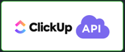

# MMM-ClickUPv2
This is an extension for the [MagicMirror](https://github.com/MichMich/MagicMirror).
It can display your tasks from your ClickUP Todo List.
You can add multiple instances of this module with different lists selected.
Only one account supported.
The requests to the server will be paused if this module is not displayed currently on the Mirror (either because of the use of carousel or hidden by Remote-Control for example) or by the use of a PIR sensor and the module MMM-PIR-Sensor.
An immediate update will occur once the module returns to the display.

## Installation
1. Navigate into your MagicMirror's `modules` folder and execute the command `git clone https://github.com/AndrewMatayka/MMM-ClickUPv2.git`.
A new folder will appear, navigate into it.
2. Execute the command `npm install` in order to install the required node dependencies.

## Setup Guide
In order to properly use this module, you will have to gain an Access Code using the [MMM-ClickUPv2-Server](https://github.com/AndrewMatayka/MMM-ClickUPv2-Server) retriever.
As well as create an App through ClickUP for API Access.
This program should be ran either on your local computer or the Magic Mirror.

*If you are using the Magic Mirror to run the program, you will have to take note of its local ip for later.

To setup this module, follow these steps:
#### Setting up your ClickUP App
1. Open your ClickUP workspace on the Desktop App relevant to you.
2. Click your profile picture / workspace icon with the dropdown arrow in the bottom left corner.
3. In the options that pop up, select `Integrations`.
4. Find the Option that says ClickUP Api, as shown here.


5. Click the Green Plus near the right side that says `+ Create an App`.
6. Enter `MMM-ClickUPv2` as the `App Name`.
7. Enter `127.0.0.1` as the `Redirect URL(s)`.
   If you aren't going to be accessing the web server from the same computer as it's running, then make sure to also add the ip of that computer here with a comma.
   When you start the web server it will display its ip.
8. Click the Green box that says `Create App`.
9. Copy the `Client ID` and `Client Secret` that you are shown to your `config/config.js`.
It may also be a good idea to note these values down so you don't lose them later.
10. Take the `Client ID` you copied and proceed to the following step!

#### Getting your Access Code
1. Clone the Git Repository into a local directory by running the following command `git clone https://github.com/AndrewMatayka/MMM-ClickUPv2-Server.git`.
2. CD into the directory with the following command `cd ./MMM-ClickUPv2-Server`.
3. Make sure all the required dependencies are installed by running the following command `npm start`.
4. Start the Web Server by running `npm start`.
5. Take note of the IP Address given in the Terminal. This can be found after the following text `Express Server exposed on IP: {IP-HERE}`
6. On the same computer or another computer navigate to that ip in your browser. If you get a warning about The connection not being private, find the button for visiting the website anyways and proceed.
7. On the page that loads, insert the Client ID that you got when you first registered your app with ClickUP into the corresponding Text Field.
8. Press the button that says `Authorize!`.
9. On the page that opens up, select the Workspace you are looking to use, and press the green button at the bottom that says `Connect Workspace`.
10. Once you are redirected back to where you started, copy the Access Code Value that you received and insert it into `config/config.js`.

Once both of these steps have been completed, you should now have everything necessary setup and should be good to run the Module and enjoy it!

## Using the Module
In order to use this module, you must add it to the modules array in the `config/config.js` file.

For Example:
````javascript
modules: [
    {
        module: 'MMM-ClickUPv2',
        position: 'middle_center', //This can be any of the regions. Best results in left or right regions.
        header: 'ClickUP', //This is optional
        config: {
            folderName: "Education", //The name of the Folder that your List is in.
            listName: "Homework", //The name of the List that you want to get Tasks from.
            updateInterval: 60 * 1000, //How often the Module will update (Min * Sec * MS) 60 Seconds
            taskTypes: ["Class", "Type"], //The names of the Custom Fields (Types) that you want to be shown.
            completedStatus: "submitted", //The name of your completed Status. Used to cross off or remove already completed Tasks.
            maxCompletedTaskCount: 3, //The maximum number of completed Tasks to show on screen crossed off.
            dontShowUntilStartDate: true, //If this is true, it will hide any tasks until their start date. If false will show all tasks as normal
            includeTextInStatusIndicatorCell: true,
            showSubmittedSubtasks: false,
            clientID: "", //Your Client-ID That you get when registering an app.
            clientSecret: "", //Your Client-Secret that you get when registering an app.
            accessCode: "", //The accessCode that we got from the guide. Using [MMM-ClickUPv2-Server]
            debug: false //Whether or not to show Debug info.
        }
    }
]
````

## Configuration Options
The following properties are able to be configured inside of `config/config.js`.

Option | Description
------ | ------
folderName | The name of the Folder that you want to get your List from.<br><br>**Possible values:** `string`<br>**Default value:** `Education`<br><br>**This value and the listName entry must be specified.** If both the folderName and listName are not specified, then no tasks will be shown.
listName | The name of the List that you want to get your Tasks from.<br><br>**Possible values:** `string`<br>**Default value:** `Homework`<br><br>**This value and the listName entry must be specified.** If both the folderName and listName are not specified, then no tasks will be shown.
updateInterval | The amount of time it takes until the Tasks will be refreshed.<br><br>**Possible values:** `int`<br>**Default value:** `60 * 1000`
taskTypes | The names of the Custom Fields (Types) that you want to be displayed.<br><br>**Possible values:** `array`<br>**Default value:** `["Class", "Type"]`<br><br>**Note:** If `debug` is enabled, the Javascript Console in your browser will list the possible Custom Fields (Types) that you can use.
completedStatus | The name of the Completed Status in your ClickUP List.<br><br>**Possible values:** `string`<br>**Default value:** `submitted`
maxCompletedTaskCount | The maximum amount of completed tasks to be shown with other tasks (crossed off).<br><br>**Possible values:** `int`<br>**Default value:** `3`
dontShowUntilStartDate | Whether or not to show tasks before their Start Date.<br><br>**Possible values:** `boolean`<br>**Default value:** `true`
includeTextInStatusIndicatorCell | Whether to show the Status Text inside of the Status Indicator Cell.<br><br>**Possible values:** `boolean`<br>**Default value:** `true`<br><br>**Note:** Activating this will move the status indicator to the right of the Task Title, next to the rest of the fields.
showSubmittedSubtasks | Whether or not to show Completed SubTasks.<br><br>**Possible values:** `boolean`<br>**Default value:** `false`
clientID | The Client ID that you got in the Setup Guide.<br><br>**Possible values:** `string`<br>**Default value:** `none`<br><br>**Note:** Used for API requests when contacting the ClickUP API.
clientSecret | The Client Secret that you got in the Setup Guide.<br><br>**Possible values:** `string`<br>**Default value:** `none`<br><br>**Note:** Used for API requests when contacting the ClickUP API.
accessCode | The Client Access Code that you got in the Setup Guide..<br><br>**Possible values:** `string`<br>**Default value:** ``<br><br>**Note:** Used for API requests when contacting the ClickUP API. This is a one-time use for generating the Access Token.
debug | Whether or not to put the Module into Debug mode, where it shows an increased amount of logs and data.<br><br>**Possible values:** `boolean`<br>**Default value:** `false`

## Dependencies
* [request](https://www.npmjs.com/package/request) (Installed via `npm install` from [Installation](#installation))

# Screenshots
A few sample screenshots in order to show you what this module looks like.
It is fairly configurable and is subject to be changed depending on how you use ClickUP.

# Attribution
This project is based on work done by Chris Brooker in the [MMM-Todoist](https://github.com/cbrooker/MMM-Todoist/) module.

# The MIT License (MIT)
Copyright © 2021 Andrew Matayka

Permission is hereby granted, free of charge, to any person obtaining a copy of this software and associated documentation files (the “Software”), to deal in the Software without restriction, including without limitation the rights to use, copy, modify, merge, publish, distribute, sublicense, and/or sell copies of the Software, and to permit persons to whom the Software is furnished to do so, subject to the following conditions:

The above copyright notice and this permission notice shall be included in all copies or substantial portions of the Software.

The software is provided “as is”, without warranty of any kind, express or implied, including but not limited to the warranties of merchantability, fitness for a particular purpose and noninfringement. In no event shall the authors or copyright holders be liable for any claim, damages or other liability, whether in an action of contract, tort or otherwise, arising from, out of or in connection with the software or the use or other dealings in the software.
